# oneulFarm 전체 사용자 흐름도

## 개요
- 기준 코드
  - 프론트: `frontend/src/App.js`, `frontend/src/components/ProductApp.js`, `frontend/src/AccountApp.js`, `frontend/src/AdminApp.js`
  - 백엔드: `backend/src/main/java/com/app/controller/*`
- 정리 범위
  - 일반 사용자
  - 로그인 사용자
  - 임시 비밀번호 발급 후 강제 비밀번호 변경 사용자
  - 관리자 운영 흐름
- 작성 원칙
  - 실제 라우트와 실제 API만 반영한다.
  - 구현상 존재하는 준비 흐름과 실제로 연결된 흐름은 구분해서 적는다.

## 핵심 구현 메모
- 앱 진입은 해시 라우팅 기준으로 `MainPage`, `ProductApp`, `AccountApp`, `RecommendPage`, `AdminApp` 로 분기된다.
- 로그인 상태는 `localStorage.oneulFarmAuthUser` 와 JWT 기반으로 관리된다.
- 임시 비밀번호 사용자는 일반 화면 대신 `#/password-change` 흐름으로 강제된다.
- 관리자 진입은 별도 로그인 화면이 아니라 `localStorage.oneulFarmAdminMode` 토글 기반이다.
- 체크아웃은 기본 배송지(`/api/users/me/addresses`)가 있어야 정상 진행된다.
- 현재 `ProductApp` 은 체크아웃에서 배송지 설정 모달을 직접 열어주지 않으므로, 배송지는 사실상 마이페이지에서 미리 준비되어 있어야 한다.
- Toss 결제 성공/실패 콜백 처리 로직은 존재하지만, 현재 체크아웃 화면에서 Toss SDK 호출까지 직접 이어지는 버튼 플로우는 연결되어 있지 않다.

## 빠른 참조 표

### 화면/라우트 요약표

| 구분 | 대표 라우트 | 렌더 앱/화면 | 로그인 필요 | 핵심 목적 |
|---|---|---|---|---|
| 메인 | `#/`, `#/main` | `MainPage` | 아니오 | 배너, 대표 상품, 레시피 진입 |
| 상품 탐색 | `#/products` | `ProductApp > ProductListPage` | 아니오 | 상품 검색, 필터, 정렬 |
| 상품 상세 | `#/products/:productNo` | `ProductApp > ProductDetailPage` | 아니오 | 상품 정보, 장바구니, 찜 |
| 장바구니 | `#/cart` | `ProductApp > CartPage` | 예 | 수량 조절, 삭제, 주문 진입 |
| 체크아웃 | `#/checkout` | `ProductApp > CheckoutPage` | 예 | 배송지/결제수단 확인 후 주문 |
| 주문 완료 | `#/order-complete/:orderId` | `ProductApp > OrderCompletePage` | 예 | 주문 결과 확인 |
| 주문 프리뷰 | `#/orders`, `#/orders/:orderId` | `ProductApp > OrdersPage` | 예 | 주문 요약/상세 빠른 조회 |
| 로그인 | `#/login` | `ProductApp > LoginPage` | 아니오 | 로그인, 아이디 찾기, 임시 비밀번호 발급 |
| 회원가입 | `#/signup` | `ProductApp > SignupPage` | 아니오 | 신규 가입 |
| 비밀번호 강제 변경 | `#/password-change` | `PasswordChangeRequiredPage` | 예 | 임시 비밀번호 교체 |
| 마이페이지 | `#/mypage` | `AccountApp > MyPageView` | 예 | 프로필, 배송지, 비밀번호, 탈퇴 |
| 활동 | `#/mypage/activity` | `AccountApp > ActivityView` | 예 | 찜, 작성 가능 리뷰, 내 리뷰 |
| 주문관리 | `#/mypage/orders` | `AccountApp > OrdersView` | 예 | 주문 필터, 주문 상세, 리뷰 작성 진입 |
| 대시보드 | `#/dashboard` | `AccountApp > DashboardView` | 예 | 절약 통계, 구매 패턴 |
| 레시피 목록 | `#/recipes` | `ProductApp > RecipeListPage` | 아니오 | 레시피 탐색 |
| 레시피 상세 | `#/recipes/:recipeNo` | `ProductApp > RecipeDetailPage` | 아니오 | 레시피 확인, 관련 상품 담기, 레시피 리뷰 |
| 시세분석 | `#/price-analysis` | `ProductApp > PriceAnalysisPage` | 아니오 | 가격 추이, 관련 레시피 |
| 추천 | `#/recommend` | `RecommendPage` | 아니오, 일부 개인화는 로그인 필요 | 구매 패턴 + 시세 + 검색 트렌드 기반 추천 |
| 관리자 | `#/admin*` | `AdminApp` | 관리자 모드 필요 | 운영 관리 |

### API 도메인 요약표

| 도메인 | 주요 API | 프론트 사용 화면 | 역할 |
|---|---|---|---|
| 인증 | `/api/auth/*` | 로그인, 회원가입, 비밀번호 변경 강제 | 가입, 로그인, 아이디 찾기, 임시 비밀번호 발급 |
| 상품 | `/api/products*` | 메인, 상품 목록, 상품 상세, 추천, 시세분석, 활동 | 상품 목록/상세 조회 |
| 장바구니 | `/api/cart/me/*` | 장바구니, 상품 상세, 활동 | 담기, 수량 변경, 삭제, 비우기 |
| 주문 | `/api/orders/me*` | 체크아웃, 주문 프리뷰, 마이페이지 주문관리 | 주문 생성, 주문 목록/상세 |
| 결제 | `/api/payments/toss/*` | 결제 성공 콜백 | Toss 설정 조회, 승인 확인 |
| 사용자 | `/api/users/me*` | 마이페이지 | 프로필, 이미지, 비밀번호, 탈퇴 |
| 배송지 | `/api/users/me/addresses*` | 마이페이지, 체크아웃 | 배송지 목록/등록/수정/삭제/기본설정 |
| 리뷰 | `/api/reviews*` | 활동, 주문관리 | 상품 리뷰 작성/수정/삭제 |
| 대시보드 | `/api/dashboard/*` | 대시보드, 추천 | 절약 통계, 구매 패턴 |
| 레시피 | `/api/recipes*` | 레시피 목록/상세, 추천, 시세분석 | 레시피 조회, 레시피 리뷰 |
| 시세 | `/api/prices*` | 시세분석, 추천 | 품목 가격 추이 조회 |
| 추천 | `/api/recommendations/*` | 추천 | 외부 검색 트렌드 연계 |
| 관리자 | `/api/admin/*`, `/api/admin/recipes/sync` | 관리자 화면 전체 | 상품, 주문, 회원, 매입/소분, 콘텐츠 관리 |

## Journey 스타일 사용자 여정

### Journey 1. 비회원 탐색 여정

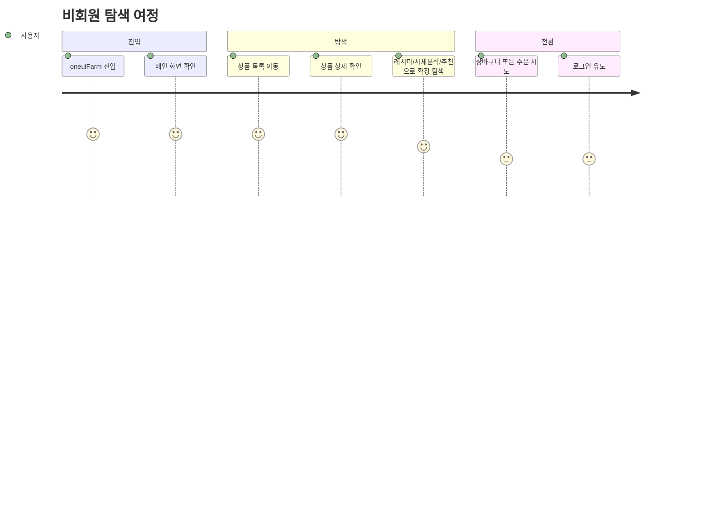

이 여정이 설명하는 라우트: `#/`, `#/products`, `#/products/:productNo`, `#/recipes`, `#/recipes/:recipeNo`, `#/price-analysis`, `#/recommend`, `#/login`

- 비로그인 사용자는 메인, 상품, 레시피, 시세분석, 추천까지는 바로 접근 가능하다.
- 상품 상세에서 장바구니 담기나 주문 계열 행동을 시작하면 `#/login` 으로 이동한다.

### Journey 2. 인증 및 계정 진입 여정

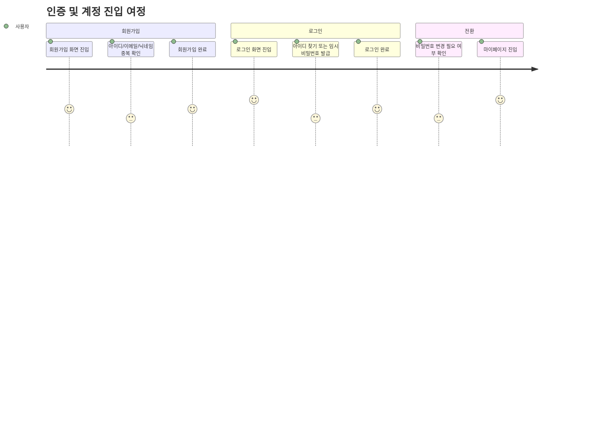

이 여정이 설명하는 라우트: `#/signup`, `#/login`, `#/password-change`, `#/mypage`

- `passwordChangeRequired` 가 켜진 계정은 일반 보호 API 대신 비밀번호 변경 흐름으로 먼저 이동한다.
- 임시 비밀번호 발급 후 재로그인한 사용자는 `#/password-change` 를 거친 뒤 `#/mypage` 로 진입한다.

### Journey 3. 구매 및 주문 여정

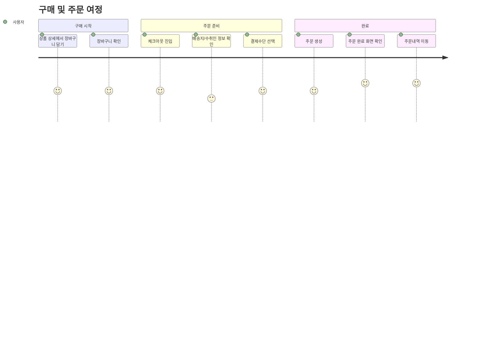

이 여정이 설명하는 라우트: `#/products/:productNo`, `#/cart`, `#/checkout`, `#/order-complete/:orderId`, `#/mypage/orders`

- 체크아웃 전 기본 배송지가 필요하며, 현재 구현상 배송지는 사실상 마이페이지에서 먼저 준비되어 있어야 한다.
- 현재 기본 주문 흐름은 `POST /api/orders/me` 이고, Toss 결제 성공/실패 콜백 로직은 별도로 준비되어 있다.

### Journey 3-1. Toss 준비 흐름

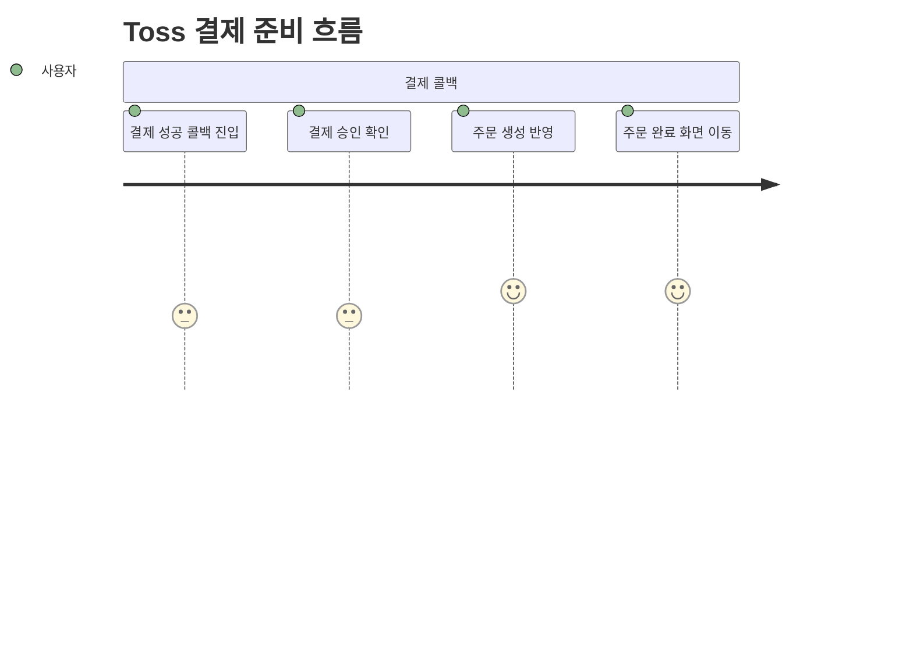

이 여정이 설명하는 라우트: `#/payment-success`, `#/payment-fail`, `#/order-complete/:orderId`

- 결제 실패 시 `#/payment-fail` 로 이동하고, 사용자는 다시 체크아웃으로 돌아가 재시도한다.
- 체크아웃 UI에는 Toss 준비 상태가 보이지만, 현재 저장소 기준으로 기본 제출 흐름은 직접 주문 생성 쪽이 먼저 연결되어 있다.

### Journey 4. 마이페이지 및 리뷰 여정

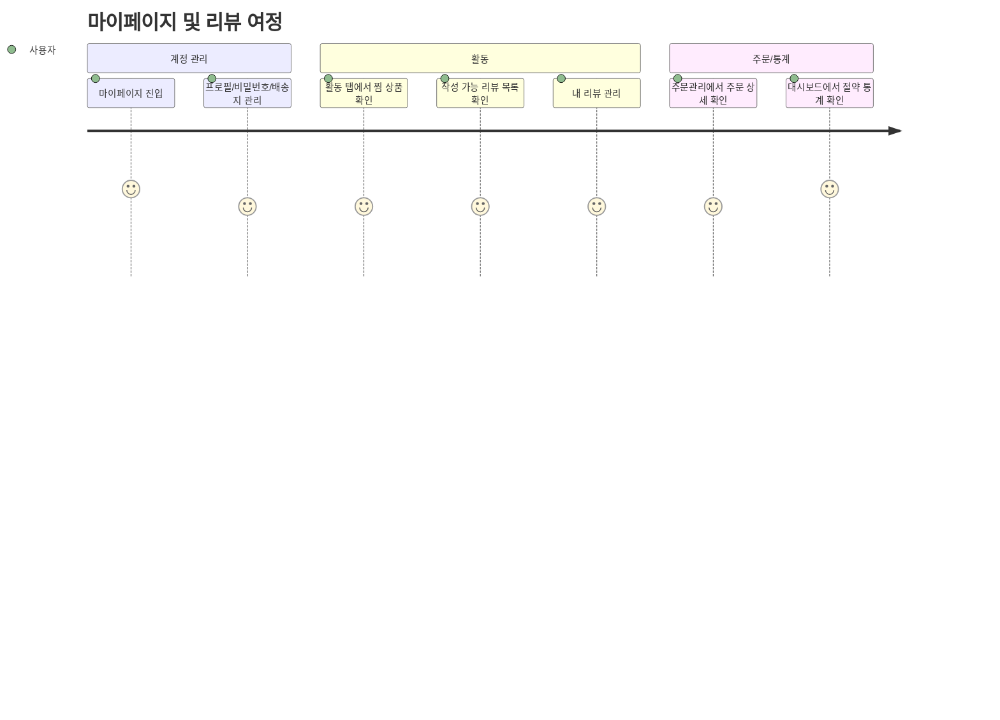

이 여정이 설명하는 라우트: `#/mypage`, `#/mypage/activity`, `#/mypage/orders`, `#/dashboard`

- 주문 상세에서 배송 상태가 `DELIVERED` 이고 기존 리뷰가 없을 때만 리뷰 작성이 가능하다.
- 활동 탭과 대시보드는 주문 데이터, 절약 금액, 리뷰 상태를 재사용하는 개인화 영역이다.

### Journey 5. 관리자 운영 여정

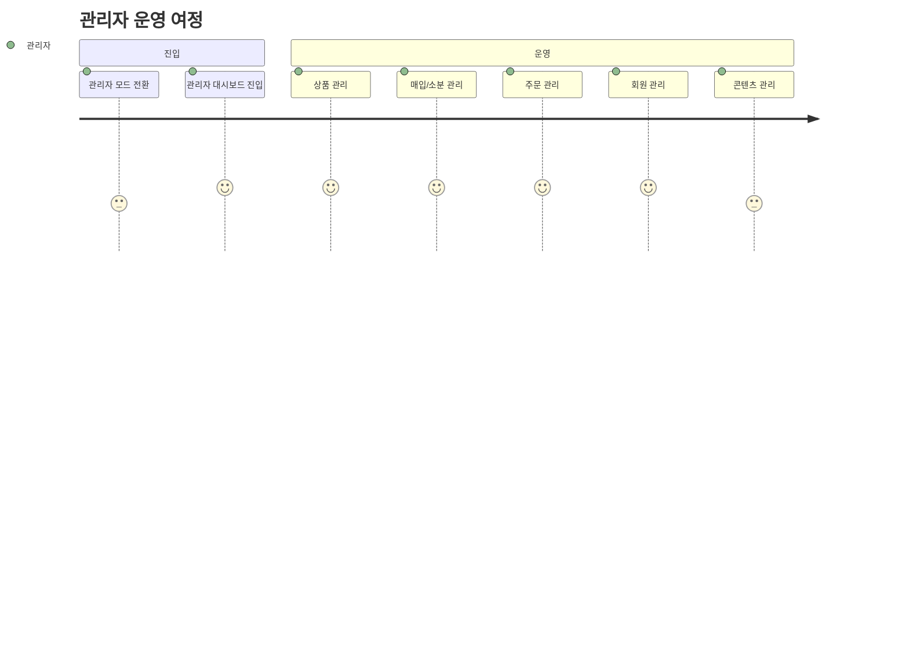

이 여정이 설명하는 라우트: `#/admin`, `#/admin/products`, `#/admin/purchase`, `#/admin/orders`, `#/admin/users`, `#/admin/content`

- 관리자 진입은 별도 인증 화면이 아니라 `admin mode` 토글 기반이다.
- 현재 구현 기준으로 관리자 화면은 운영 UI 중심이며, `/api/admin/*` 는 일반 보호 API와 같은 JWT 필터 체계로 묶여 있지 않다.

## 1. 전체 구조 흐름도

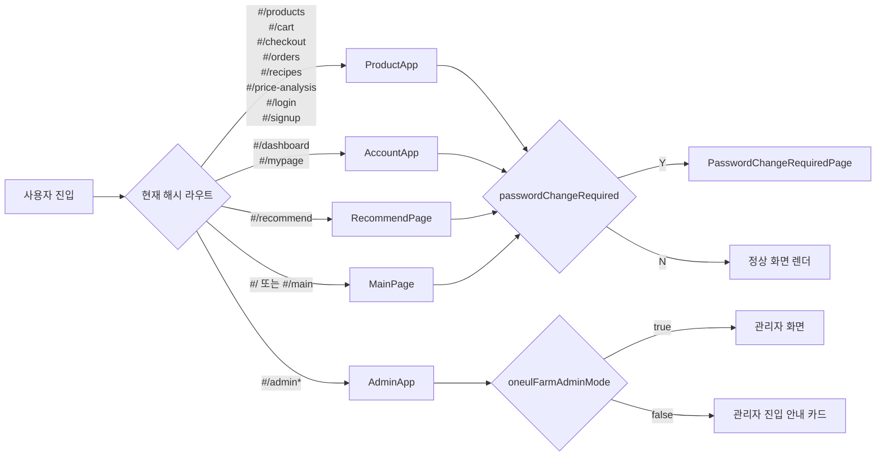

### 전체 구조 해설

| 화면 | 진입 라우트 | 주요 액션 | 호출 API | 다음 상태 |
|---|---|---|---|---|
| MainPage | `#/`, `#/main`, `#/home` | 메인 배너, 추천 상품, 레시피 진입 | `GET /api/main` | 상품/레시피/추천/시세분석으로 이동 |
| ProductApp | `#/products`, `#/cart`, `#/checkout`, `#/recipes`, `#/price-analysis`, `#/login`, `#/signup` 등 | 탐색, 장바구니, 주문, 인증 화면 렌더 | `/api/products`, `/api/cart/me/*`, `/api/orders/me*`, `/api/recipes*`, `/api/prices*`, `/api/auth/*` | 상품 상세, 주문, 레시피, 로그인/회원가입 |
| AccountApp | `#/dashboard`, `#/mypage`, `#/mypage/activity`, `#/mypage/orders` | 프로필, 배송지, 리뷰, 주문, 대시보드 | `/api/users/me*`, `/api/users/me/addresses*`, `/api/reviews*`, `/api/orders/me*`, `/api/dashboard/*` | 마이페이지 세부 탭 이동 |
| RecommendPage | `#/recommend` | 추천 리스트, 검색 트렌드, 개인화 추천 확인 | `/api/products`, `/api/dashboard/patterns`, `/api/dashboard/product-savings`, `/api/prices/trend`, `/api/recommendations/popular-searches`, `/api/recipes` | 상품 상세, 레시피 상세 |
| AdminApp | `#/admin*` | 관리자 대시보드/상품/주문/회원/콘텐츠 관리 | `/api/admin/*`, `/api/admin/recipes/sync` | 관리자 세부 탭 이동 |
| PasswordChangeRequiredPage | 전역 인터셉트 | 임시 비밀번호를 새 비밀번호로 교체 | `PATCH /api/auth/password` | 성공 시 `#/mypage`, 실패 시 화면 유지 |

## 2. 구매 중심 사용자 흐름도

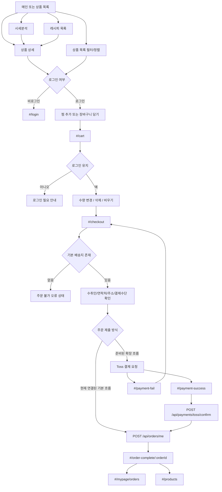

### 구매 흐름 해설

| 화면 | 진입 조건 | 주요 액션 | 호출 API | 다음 상태 |
|---|---|---|---|---|
| 상품 목록 | `#/products` | 검색, 카테고리, 가격대, 태그, 정렬 | `GET /api/products` | 상품 상세 |
| 상품 상세 | `#/products/:productNo` | 장바구니 담기, 찜 토글, 연관 레시피 이동 | `GET /api/products/:productNo` | 장바구니, 레시피 |
| 장바구니 | `#/cart` | 수량 수정, 삭제, 비우기 | `GET /api/cart/me`, `POST /api/cart/me/items`, `PATCH /api/cart/me/items/:productNo`, `DELETE /api/cart/me/items*` | 체크아웃 |
| 체크아웃 | `#/checkout` | 기본 배송지 로드, 결제수단 선택, 주문 제출 | `GET /api/users/me/addresses`, `POST /api/orders/me` | 주문 완료 |
| 결제 성공 콜백 | `#/payment-success` | 결제 승인 확인 후 주문 생성 | `POST /api/payments/toss/confirm`, `POST /api/orders/me` | 주문 완료 |
| 결제 실패 콜백 | `#/payment-fail` | 실패 메시지 확인 | 없음 | 체크아웃 복귀 |
| 주문 완료 | `#/order-complete/:orderId` | 주문번호/금액/배송지 확인 | 주문 생성 응답 재사용 | 주문내역 또는 상품 목록 |
| 주문 프리뷰 | `#/orders`, `#/orders/:orderId` | 주문 프리뷰 확인 | `GET /api/orders/me`, `GET /api/orders/me/:orderNo` | 마이페이지 주문관리 또는 상품 목록 |

### 구매 흐름 구현 포인트
- 비로그인 사용자는 장바구니 담기, 장바구니 열기, 체크아웃, 주문내역 열기 시 `#/login` 으로 이동한다.
- 직접 `#/cart`, `#/checkout`, `#/orders` 로 진입하면 로그인 필요 안내 화면이 렌더될 수 있다.
- 주문 생성 후 재고는 차감되고, 장바구니는 비워지며, 주문 완료 화면은 생성된 주문 응답을 그대로 사용한다.
- 현재 체크아웃 UI는 Toss 준비 상태를 보여주지만, 기본 제출 흐름은 바로 `POST /api/orders/me` 로 연결된다.

## 3. 계정/개인화 흐름도

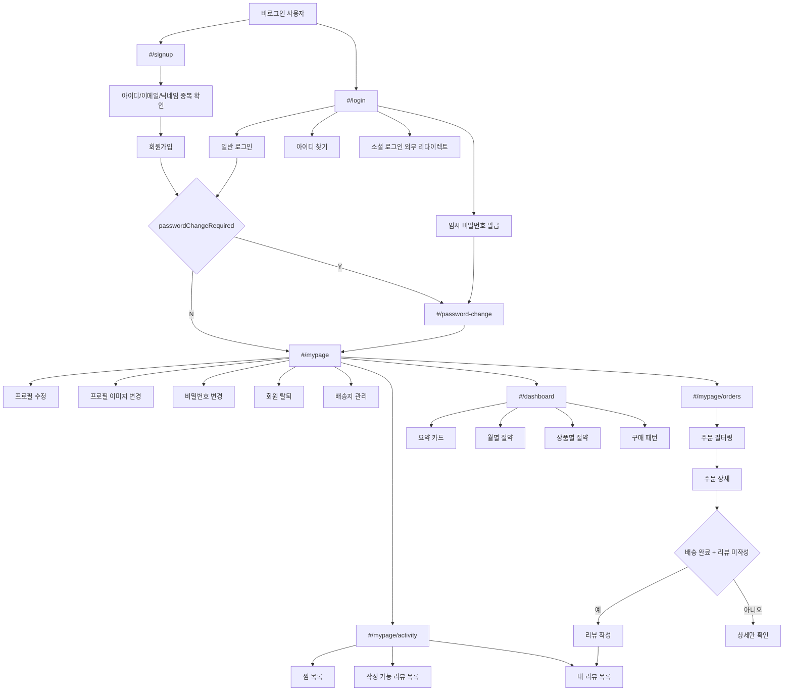

### 계정/개인화 흐름 해설

| 화면 | 진입 조건 | 주요 액션 | 호출 API | 다음 상태 |
|---|---|---|---|---|
| 회원가입 | `#/signup` | 아이디/이메일/닉네임 중복 확인 후 가입 | `GET /api/auth/check-userid`, `GET /api/auth/check-email`, `GET /api/auth/check-nickname`, `POST /api/auth/signup` | 비밀번호 변경 강제 또는 마이페이지 |
| 로그인 | `#/login` | 일반 로그인 | `POST /api/auth/login` | 비밀번호 변경 강제 또는 마이페이지 |
| 아이디 찾기 | 로그인 모달 | 이메일+전화번호로 아이디 조회 | `POST /api/auth/find-userid` | 로그인 폼에 아이디 반영 |
| 임시 비밀번호 발급 | 로그인 모달 | 이메일로 임시 비밀번호 발급 | `POST /api/auth/reset-password` | 이후 로그인 후 비밀번호 변경 강제 |
| 강제 비밀번호 변경 | `#/password-change` | 현재 임시 비밀번호와 새 비밀번호 입력 | `PATCH /api/auth/password` | `#/mypage` |
| 마이페이지 | `#/mypage` | 프로필 수정, 이미지 변경, 비밀번호 변경, 탈퇴, 배송지 관리 | `GET /api/users/me`, `PATCH /api/users/me`, `PATCH /api/users/me/profile-image`, `PATCH /api/users/me/password`, `PATCH /api/users/me/withdraw`, `GET /api/users/check-*` | 활동/주문/대시보드 또는 로그인 종료 |
| 배송지 관리 | 마이페이지 모달 | 목록 조회, 등록, 수정, 기본배송지 변경, 삭제 | `GET /api/users/me/addresses`, `POST /api/users/me/addresses`, `PATCH /api/users/me/addresses/:addressNo`, `PATCH /api/users/me/addresses/:addressNo/default`, `DELETE /api/users/me/addresses/:addressNo` | 마이페이지 복귀 |
| 활동 탭 | `#/mypage/activity` | 찜 상품 보기, 장바구니 담기, 리뷰 작성/수정/삭제 | `GET /api/products`, `GET /api/reviews/me/writable`, `GET /api/reviews/me`, `POST /api/reviews`, `PATCH /api/reviews/:reviewNo`, `DELETE /api/reviews/:reviewNo` | 상품 상세 또는 활동 탭 유지 |
| 주문관리 | `#/mypage/orders` | 배송상태/기간 필터, 주문 상세 확인, 리뷰 작성 진입 | `GET /api/orders/me`, `GET /api/orders/me/:orderNo` | 리뷰 작성 또는 주문관리 유지 |
| 대시보드 | `#/dashboard` | 총 절약금액, 월별 절약, 상품별 절약, 구매 패턴 확인 | `GET /api/dashboard/summary`, `GET /api/dashboard/monthly-savings`, `GET /api/dashboard/product-savings`, `GET /api/dashboard/patterns` | 대시보드 유지 |

### 계정 흐름 구현 포인트
- JWT 필터는 `/api/cart/*`, `/api/orders/*`, `/api/users/*`, `/api/dashboard/*`, `PATCH /api/auth/password` 에 인증을 요구한다.
- 임시 비밀번호 상태(`tempPasswordYn=Y`)면 비밀번호 변경 API 외 다른 보호 API 접근이 차단된다.
- 리뷰 작성 가능 여부는 주문 상세 응답에서 `deliveryStatus=DELIVERED` 이고 기존 리뷰가 없는 경우로 계산된다.
- 추천 페이지는 로그인 사용자의 구매 패턴과 상품 절약 데이터를 재사용해 개인화 추천을 강화한다.
- 로그인 화면의 카카오/네이버/구글 버튼은 외부 인증 URL로 리다이렉트하지만, 현재 저장소에는 해당 콜백 완료 화면이 구현되어 있지 않다.

## 4. 관리자 운영 흐름도

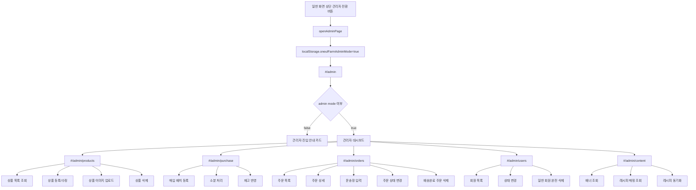

### 관리자 흐름 해설

| 화면 | 진입 조건 | 주요 액션 | 호출 API | 다음 상태 |
|---|---|---|---|---|
| 관리자 진입 | `#/admin` | 관리자 모드 확인 | 없음 | 안내 카드 또는 관리자 대시보드 |
| 관리자 대시보드 | `#/admin` | 오늘 주문/매출/저재고/활성회원 요약 확인 | `GET /api/admin/products`, `GET /api/admin/orders`, `GET /api/admin/users`, `GET /api/admin/purchases`, `GET /api/admin/content/banners`, `GET /api/admin/content/recipe-mappings` | 각 관리자 탭 |
| 상품 관리 | `#/admin/products` | 상품 저장, 이미지 업로드, 삭제 | `GET /api/admin/product-categories`, `GET /api/admin/products`, `POST /api/admin/products`, `PATCH /api/admin/products/:productNo`, `POST /api/admin/products/:productNo/images`, `DELETE /api/admin/products/:productNo` | 상품 목록 갱신 |
| 매입/소분 | `#/admin/purchase` | 매입 배치 생성, 소분 처리, 재고 반영 | `GET /api/admin/purchases`, `GET /api/admin/package-histories`, `POST /api/admin/purchases`, `POST /api/admin/purchases/:batchNo/package` | 매입/소분 이력 갱신 |
| 주문 관리 | `#/admin/orders` | 상세 조회, 운송장 입력, 상태 변경, 주문 삭제 | `GET /api/admin/orders`, `GET /api/admin/orders/:orderNo`, `PATCH /api/admin/orders/:orderNo`, `DELETE /api/admin/orders/:orderNo` | 주문 상태 갱신 |
| 회원 관리 | `#/admin/users` | 회원 상태 변경, 일반 회원 완전 삭제 | `GET /api/admin/users`, `PATCH /api/admin/users/:userNo`, `DELETE /api/admin/users/:userNo` | 회원 목록 갱신 |
| 콘텐츠 관리 | `#/admin/content` | 배너/레시피 매핑 확인, 레시피 동기화 | `GET /api/admin/content/banners`, `GET /api/admin/content/recipe-mappings`, `POST /api/admin/recipes/sync` | 콘텐츠 목록 갱신 |

### 관리자 흐름 구현 포인트
- 프론트 관리자 화면은 `oneulFarmAdminMode` 와 `DEMO_USER_NO=1` 에 의존한다.
- 관리자 API 호출 시 프론트는 실제 로그인 사용자 대신 고정 `X-USER-NO` 헤더를 사용한다.
- 현재 JWT 필터는 `/api/admin/*` 를 보호 대상으로 두지 않으므로, 관리자 권한 처리는 “현재 구현 기준”으로 보면 완전한 인증/인가 체계가 아니라 관리자 모드 기반 운영 UI에 가깝다.
- 주문 삭제는 `COMPLETED` 이고 배송상태가 `DELIVERED` 인 주문만 가능하다.
- 상품 삭제는 주문 이력이 없는 상품만 가능하다.
- 회원 완전 삭제는 일반 사용자 계정만 가능하고, 소분 이력이 있는 계정은 삭제되지 않는다.

## 5. 추천/시세/레시피 보조 흐름

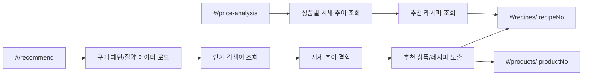

### 보조 흐름 해설

| 화면 | 주요 액션 | 호출 API | 다음 상태 |
|---|---|---|---|
| 시세분석 | 상품 후보 선택, 365일 추이 조회, 관련 레시피 조회 | `GET /api/products`, `GET /api/prices/trend`, `GET /api/recipes` | 상품 상세, 레시피 상세 |
| 추천 | 개인 패턴, 인기 검색어, 시세 흐름, 레시피를 조합한 큐레이션 | `GET /api/products`, `GET /api/dashboard/patterns`, `GET /api/dashboard/product-savings`, `POST /api/recommendations/popular-searches`, `GET /api/prices/trend`, `GET /api/recipes` | 상품 상세, 레시피 상세 |
| 레시피 상세 | 관련 상품 장바구니 추가, 레시피 리뷰 조회/작성/수정/삭제 | `GET /api/recipes/:recipeNo`, `POST /api/recipes/:recipeNo/reviews`, `POST /api/recipes/:recipeNo/reviews/:reviewNo`, `DELETE /api/recipes/:recipeNo/reviews/:reviewNo` | 장바구니, 상품 상세 |

## 6. 검증 체크리스트
- 각 Mermaid 노드가 실제 해시 라우트와 대응되는지 확인 완료
- 로그인 필요 분기, 강제 비밀번호 변경 분기, 주문 완료 분기, 결제 성공/실패 분기 반영 완료
- 주문 상세 기반 리뷰 작성 가능 조건 반영 완료
- 추천 페이지가 대시보드 데이터와 시세 데이터를 재사용하는 흐름 반영 완료
- 관리자 흐름이 화면 탭과 관리자 API 묶음에 대응되도록 정리 완료

## 7. 요약
- oneulFarm은 `메인 탐색`, `상품/주문`, `계정/개인화`, `추천/시세`, `관리자 운영` 이 해시 라우트 기준으로 분리된 구조다.
- 실사용 핵심 흐름은 `상품 탐색 -> 장바구니 -> 체크아웃 -> 주문 완료 -> 주문/리뷰/대시보드 재활용` 이다.
- 계정 흐름의 가장 중요한 제약은 `임시 비밀번호 사용자 강제 변경` 과 `기본 배송지 선행 필요` 이다.
- 관리자 흐름은 현재 구현상 정식 권한 시스템보다 `관리자 모드 전환형 운영 UI` 에 가깝다.
