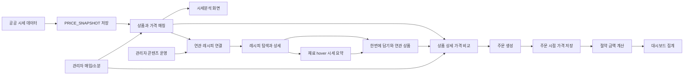

# oneulFarm 발표 슬라이드 보강안

## 1. 권장 슬라이드 구성

| 슬라이드 | 제목 | 핵심 내용 |
|---|---|---|
| 1 | 프로젝트 소개 | 프로젝트명, 한 줄 정의, 팀 목표 |
| 2 | 문제 정의 | 농산물 시세 정보는 있지만 구매 판단으로 이어지지 않는 문제 |
| 3 | 해결 방식 | 공공 시세 -> 상품 비교 -> 주문 -> 절약 대시보드 |
| 4 | 사용자 시연 요약 | 메인, 시세분석, 레시피, 상품 상세, 주문, 마이페이지, 대시보드 |
| 5 | 관리자 시연 요약 | 매입, 소분, 상품/주문/회원/레시피 매핑/콘텐츠 관리 |
| 6 | 핵심 아키텍처 | 프론트, 백엔드, DB, 시세 수집, 절약 집계 흐름 |
| 7 | 차별점과 성과 | 일반 쇼핑몰과 다른 점, 기대 효과 |
| 8 | 한계와 확장 방향 | 데모 범위, 향후 개선 방향 |

## 2. 반드시 넣어야 하는 문장
- 저희 팀은 공공 시세 데이터를 실제 구매 의사결정으로 연결했습니다.
- 저희 서비스는 구매 후 절약 효과를 대시보드로 체감하게 했습니다.
- 저희 팀은 관리자 매입과 소분 운영까지 이어지는 구조를 구현했습니다.
- 저희 서비스는 레시피 콘텐츠를 상품과 연결해 구매 이후 활용까지 이어지도록 설계했습니다.
- 저희 서비스는 레시피 재료 hover 시세와 한번에 담기 기능으로 여러 재료의 추가 구매를 유도합니다.

## 3. 한 장짜리 핵심 아키텍처 슬라이드

### 발표 멘트
이 슬라이드는 oneulFarm의 핵심 흐름을 한 장으로 정리한 것입니다.

외부 시세 데이터를 저장하고, 상품과 매칭한 뒤, 사용자는 시세분석과 상품 상세에서 비교 정보를 확인합니다.

여기에 레시피 콘텐츠를 연결해서 사용자가 재료를 어떻게 활용할지까지 바로 확인할 수 있게 했습니다.

특히 재료에 마우스를 올리면 간략한 시세 요약을 확인할 수 있고, `한번에 담기`를 통해 여러 재료를 함께 구매하도록 유도할 수 있습니다.

이후 주문 시점 기준 데이터를 저장해서 절약 금액을 계산하고, 그 결과가 대시보드로 이어집니다.

동시에 관리자 매입과 소분 데이터, 그리고 콘텐츠 운영이 상품과 레시피 연결에 반영되기 때문에 사용자 경험과 운영 구조가 하나의 흐름으로 묶입니다.

## 4. 절약 금액 설명 슬라이드용 한 줄
- 절약 금액 = `(주문 시점 평균 시세 - 실제 구매 단가) x 구매 수량`

### 짧은 멘트
저희 팀은 절약 금액을 감각적인 문구가 아니라 주문 시점 가격 데이터를 기준으로 계산해서, 사용자가 절약을 수치로 확인할 수 있게 했습니다.

## 5. 관리자 화면이 필요한 이유
- 사용자 화면의 가격 정보가 실제 운영 데이터와 연결되어야 서비스 신뢰도가 올라간다.
- 매입과 소분을 분리하지 않으면 판매가의 근거를 설명하기 어렵다.
- 상품, 주문, 회원, 레시피 매핑 같은 콘텐츠를 따로 관리하면 운영 흐름이 끊기기 때문에 통합 관리가 필요하다.

### 발표 멘트
저희 팀은 관리자 화면을 단순 부가 기능으로 보지 않았습니다.

사용자에게 보여주는 가격과 상품 정보가 실제 운영 흐름과 연결되어야 서비스가 완성된다고 봤기 때문입니다.

## 6. 실제 연동 범위와 데모 범위 구분 슬라이드

| 구분 | 실제 연동 범위 | 발표 시 강조 방식 |
|---|---|---|
| 메인, 상품, 마이페이지, 주문관리 | 실제 API 연동 | 직접 시연 |
| 대시보드 | 실제 API 연동 | 직접 시연 |
| 시세분석 | 실제 API 연동 | 직접 시연 |
| 레시피 | 실제 API 연동 | 직접 시연 |
| 관리자 운영 | 실제 API 연동 | 직접 시연 |
| 결제 | 설정 조회 및 승인 API 존재, 발표 환경 의존성 있음 | 체크아웃 구조 중심 설명 |

### 발표 멘트
발표에서는 현재 안정적으로 보여줄 수 있는 핵심 흐름을 직접 시연하고, 외부 환경 영향을 받는 구간은 짧게 설명 중심으로 정리하겠습니다.

핵심은 기능 개수보다 서비스 가치가 한 흐름으로 이어진다는 점입니다.

## 7. 실패 대비용 스크린샷 목록
- 메인페이지 전체
- 시세분석 차트가 잘 나온 화면
- 상품 상세에서 평균 시세와 절약률이 보이는 화면
- 마이페이지 활동 화면
- 대시보드 KPI와 월별 차트 화면
- 관리자 매입/소분 화면
- 관리자 상품 관리 화면
- 관리자 주문 관리 화면

## 8. 팀 발표 분배 예시

| 담당 | 권장 파트 |
|---|---|
| 발표자 1 | 오프닝, 문제 정의, 서비스 소개 |
| 발표자 2 | 사용자 시연 |
| 발표자 3 | 관리자 시연, 기술 구조, 마무리 |

### 분배 원칙
- 사용자 시연은 한 명이 끊지 않고 이어서 진행하는 편이 안정적이다.
- 기술 설명은 가장 구현 내용을 잘 아는 사람이 맡는다.
- 개인 기여 소개가 필요하면 기술 설명 직후 20초 이내로 넣는다.

## 9. 슬라이드 디자인 원칙
- 한 슬라이드에 문장을 너무 많이 넣지 않는다.
- 시세 기반 비교, 절약 체감, 운영 연결이라는 세 키워드만 반복한다.
- 필요할 때는 여기에 `활용 콘텐츠 연결`을 네 번째 키워드로 짧게 보강한다.
- 레시피를 설명할 때는 `hover 시세`, `한번에 담기`, `추가 구매 유도` 세 표현을 같이 묶어 말한다.
- 표보다 실제 화면 캡처를 우선 사용한다.
- 기술 슬라이드는 스택 나열보다 데이터 흐름을 먼저 보여준다.
